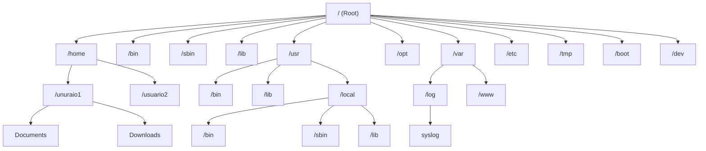

# Module Checklist

# Operating Systems & Linux Basics

# By TechWorld with Nana

# Video Overview

- Introduction to Operating Systems
- Introduction to Virtual Machines (VM Part 1)
- Setup a Linux Virtual Machine (VM Part 2)
- Linux File System
- Introduction to Command Line Interface (CLI Part 1)
- Basic Linux Commands (CLI Part 2)
- Package Manager - Installing Software on Linux
- Vi & Vim Text Editor
- Users & Permissions - Part 1
- Users & Permissions - Part 2
- Basic Linux Commands - Pipes & Redirects (CLI Part 3)
- Shell Scripting - Part 1 (Intro to Shell Scripting)
- Shell Scripting - Part 2 (Basic Concepts & Syntax)
- Shell Scripting - Part 3 (Basic Concepts & Syntax)
- Environment Variables
- Networking
- SSH - Secure Shell

### Introduction to Operating Systems

- [x] Watched video

**Notes:**

* **What is an Operating System?** The computer is made up of hardware, such as Memory, Storage, CPU, and input/output devices. To interact with the hardware, applications like a browser and Visual Studio Code use the Operating System (OS). It is the OS that is able to talk to the hardware and handle the necessary requirements of the applications.
* **What is the CPU?** The CPU is responsible for handling the processes.
  * **Process:** Is any activity that applications perform on the operating system. Every process has its own identifier that helps the CPU manage the queue.
* **What is Memory?** The RAM is responsible for handling the memory allocated in the hardware. It is used for faster access but is not permanent. Sometimes, depending on the process, it is necessary to swap data to the storage.
* **What is Storage?** Storage is the secondary memory that allocates data for long-term use.
* **File System Management:** When the data is stored on the hard drive, it is saved in a structured manner.
  * In Unix systems, it is stored in a tree file system.
  * In Windows systems, it is stored in multiple root file folders.
* **Security:** It is responsible for managing permissions.
* **Networking:** It is designed to assign ports and IP addresses.
* **Kernel:** The kernel acts as an intermediary, translating the OS requests into commands that the hardware can execute.

---

### Introduction to Virtual Machines (VM Part 1)

- [x] Watched video

**Notes:**

* **What is a Virtual Machine?** Virtualization relies on a hypervisor that communicates with the operating system and allocates a portion of the available hardware to create a new PC with virtual hardware, allowing for the installation of a new operating system.
* **Benefits:** You can have a sandbox of that operating system for practice. You can use it if you want to see what a different OS looks like, how it is managed, or if you want to try new software without risking your main operating system files. It is also useful if you want to test how an application performs on a different OS.
* **Types of hypervisors:**
  * **Type 2:** Runs over an existing operating system and is typically used on personal computers.
  * **Type 1:** Runs directly over the hardware and is commonly used by companies in data centers.
* **Advantage of Type 1 Virtualization:** One of the biggest advantages of Type 1 virtualization is the abstraction of the operating system from the hardware. This allows the entire virtual environment to exist as an image, making it portable and not tied to a specific operating system fixed to the physical hardware.

---

### Setup a Linux Virtual Machine (VM Part 2)

- [x] Watched video
- [x] Demo executed
  - [x] Setup VirtualBox
  - [x] Setup Linux Virtual Machine

**Useful Links:**

* **Download VirtualBox:** https://www.virtualbox.org/wiki/Downloads
* **Download Ubuntu:** https://ubuntu.com/download/desktop

**Step 1: VirtualBox and VM Setup**

* **Download VirtualBox:** Download the installer from the official website. The page provides options for different operating systems. You may also download previous versions if needed.
* **Installation:** Run the installer and follow the steps in the Installation Wizard.
* **Hardware Requirements:** At least 4 GB of RAM is recommended to ensure smooth performance when sharing hardware between the host and guest systems.
* **Creating the Virtual Machine (VM):**
  * Create a new VM, assign it a name, and configure the necessary resources.
  * Attach the ISO image of the operating system (in this case, `ubuntu-26.04-desktop-amd64`).
  * Start the VM to begin the OS configuration process. Once the installation is complete, remove the ISO image and reboot the VM.

**VM Management and Features**

* **Power Options:**
  * **Save the machine state:** This acts like "suspension"; when reactivated, the machine resumes exactly where it was left.
  * **Shut down the machine:** Perform a standard system shutdown.
* **Integration Features:** In the VM settings, you can enable **Shared Clipboard** and **Drag and Drop** to share data between the VM and the host system.
* **Extension Pack:** To ensure these integration features work correctly, you must download and install the VirtualBox Extension Pack on the host.
* **Guest Additions:** After starting the VM and logging into Ubuntu, install the Guest Additions:
  * Navigate to the **Devices** tab and select **Insert Guest Additions CD image**.
  * Once mounted, open the disk, right-click `autorun.sh`, and select **Run as a Program**.
  * Authenticate, let the installation finish, close the terminal, unmount the disk, and restart the VM.

---

### Linux File System

- [x] Watched video

In Windows they have a multiple root folder. In Linux is a hierarchical tree structure.

* **`/` (Root):** Is the root of all system, everything start here.
* **`/home`:** This is where all users have their personal space. If there are additional users, they will be listed here; furthermore, some system wide files are occasionally stored within specific user directories.
* **`/bin` (Binaries):** It contains the basic system commands that any user can run (e.g., `cat`, `cp`, `ls`, `cd`).
* **`/sbin` (System Binaries):** Similar to `/bin`, but these commands are for system administration and normally require root or superuser privileges (e.g., `adduser`, `chpasswd`, `iptables`).
* **`/lib` (Libraries folders):** Stores essential shared libraries that executables in `/bin` and `/sbin` need to run, while `lib32`, `lib64`, and `libx32` handle different CPU architectures.
* **`/usr` (User):** Stores system-wide user programs and data. Inside, `/usr/local` holds third-party applications you manually install, making them globally accessible to all users without altering core system files.
* **`/opt` (Optional):** Used for programs that require all components to be contained in a single directory, such as binaries and libraries, this often includes applications like IDEs and web browsers.
* **`/boot` (Booting):** It's for booting the system, that means it should never be touched.
* **`/etc` (Etcetera):** Contains system-wide configuration files for most applications, typically housing `.conf` or `.yaml` files.
* **`/dev`:** Contains files representing hardware devices (e.g., disk drives, terminals, and input devices).
* **`/var` (Variable):** Stores files that constantly change during system operation, such as log files and application caches.
* **`/tmp` (Temporary):** It holds temporary files created by applications that are deleted when the system restarts.
* **`/media` (Media):** It is where the system automatically hooks up plug-and-play devices like USB drives.
* **`/mnt` (Mount):** It is a location used to manually attach external hard drives or temporary file systems.

Understanding the Linux file system hierarchy is critical for efficient debugging and troubleshooting, enabling you to locate configuration files, logs, and system binaries quickly.

---

### Introduction to Command Line Interface (CLI Part 1)

- [x] Watched video

**1. Graphical vs. Command-Line Interfaces**

- **Graphical User Interface (GUI):** A visual environment that allows users to interact with the operating system through icons, menus, and windows. It is the standard interface for personal computing.
- **Command-Line Interface (CLI):** A text-based interface used to interact with the operating system by typing specific commands.
- **Key Differences:**
  - **Personal Computers:** Usually feature both **GUI** and **CLI**.
  - **Servers:** Typically operate using only a **CLI** to maximize performance and security.

**2. Anatomy of the Terminal**

The terminal is the application used to interact with the **CLI**. When you open a terminal window, you are presented with a command prompt that provides essential context about your session.

**The Command Prompt Breakdown**

A standard terminal prompt follows this structure: `user@hostname:path$`

- **User:** The name of the currently logged-in user (e.g., stefano).
- **Hostname:** The unique name of the computer or server you are currently accessing. This is critical in server environments to identify which machine is executing commands.
- **Path (Tilde `~`):** A shortcut representing the user's home directory.
- **Privilege Indicator:**
  - **Dollar Sign (`$`):** Indicates you are logged in as a regular user.
  - **Pound Sign (`#`):** Indicates you are logged in as a root/superuser, possessing administrative privileges.

**3. Functionality**

The terminal serves as the primary interface for instructing the operating system. Instead of performing actions manually through a visual interface (e.g., clicking to create a folder), you execute specific commands that the computer processes directly.

---

### Basic Linux Commands (CLI Part 2)

- [x] Watched video
- [x] Demo executed

**Useful Links:**

- **Link:** Cheat Sheet: https://cheatography.com/davechild/cheat-sheets/linux-command-line/
- **Link:** Cheat Sheet: https://www.guru99.com/linux-commands-cheat-sheet.html

**Linux Command Glossary**

**Basic Navigation & File Management**

- **`pwd`:** Print Working Directory; displays your current directory/location.
- **`ls`:** List files and directories in the current folder.
- **`ls -R` (list recursive):** List recursively; displays all files and folders, including those within subdirectories.
- **`la -a`:** List all; shows all files, including hidden ones (files starting with a dot).
- **`cd [directory]`:** Change directory; navigates to the specified folder.
- **`cd..`:** Moves one directory level up.
- **`cd [absolute path]`:** Moves to any location by providing the full path starting from root (`/`).
- **`mkdir`:** Make directory; creates a new folder; `mkdir [name folder]`.
- **`touch [filename]`:** Creates a blank file. (Note: `touch` primarily updates a file's timestamp, but creates the file if it does not exist).
- **`echo [text]`:** Prints the specified text to the terminal. It can be combined with `>` or `>>` to create or write into files.
- **`rm [fileName]`:** Removes (deletes) a file.
- **`rm -r`:** Removes a directory and its contents recursively. It starts at the deepest level and deletes files before removing the directory itself.

**Utility & System Commands**

- **`clear`:** Clears the terminal screen.
- **`mv [source] [destination]`:** Moves or renames a file or directory. If the destination is a new name in the same folder, it renames the file.
- **`cp [file] [destination]`:** Copies files.
- **`cp -r [folder] [destination]`:** Copies a directory and all of its contents recursively.
- **`history`:** Lists the commands previously typed in the current terminal session.
- **`cat [filename]`:** Concatenate; displays the entire content of a file.
- **`sudo [command]`:** Allows a regular user to execute commands with root (superuser) privileges.
- **`su [username]`:** Switch User; allows you to log in as a different user within the current terminal session.
- **`exit`:** Exits the current shell; logs out of the current user session or closes the terminal.
- **`less [filename]`:** Used for reading and searching through large files; allows scrolling.
- **`tail [filename]`:** Displays the last part of a file. Use `tail -f` to monitor logs in real-time.

**System Information**

- **`uname -a`:** Displays system and kernel information.
- **`cat /etc/os-release`:** Displays operating system release information.
- **`lscpu`:** Displays CPU architecture information.
- **`lsmem`:** Displays system memory information.
- **`ls /sbin`:** Lists essential system administration binaries.

**Shortcuts**

- **`Ctrl + r`:** Search your command history.
- **`Ctrl + c`:** Interrupts (kills) the currently running process.

**Examples**

- **Relative Navigation:** `cd usr/local/bin` Changes directory from your current location.
- **Backtracking:** `cd ../..` or `cd /usr` Navigates to parent directories.
- **Home Shortcut:** `cd ~` Navigates directly to the user's home directory.
- **Non-intrusive Listing:** `ls /etc/network` Lists contents of a folder without changing your current directory.

---

### Package Manager - Installing Software on Linux

- [x] Watched video
- [x] Demo executed

**Useful Links:**

- **Link:** Snap Package Manager: https://snapcraft.io/

**1. Introduction to Package Managers**

A software package is a compressed archive containing all the files an application needs to run. In Linux, application files are distributed across multiple system directories (unlike Windows, where everything usually resides in a single folder).

**Why use a Package Manager?**

- **Dependency Resolution:** Most applications depend on other software to run. The package manager automatically fetches and installs all required dependencies.
- **Centralized File Management:** It tracks exactly where every file is placed (binaries, shared libraries, etc.), allowing for clean and complete Uninstall.
- **Seamless Updates:** It allows you to upgrade software via command-line without manually uninstalling older versions.

**2. Managing Software with APT (Advanced Package Tool)**

**APT** is the default package manager for Debian-based distributions like Ubuntu. It uses the command-line interface to interact with the system's software repositories.

Note: Most installation and removal commands require elevated privileges using `sudo`.

**Core APT Commands**

- **`update`:** Refreshes the local cache of available packages and their versions from repositories. (Always run this first) `sudo apt update`
- **`search`:** Searches for a given package name or description. `apt search <package_name>`
- **`install`:** Installs one or more packages and their dependencies. `sudo apt install <package_name>`
- **`remove`:** Removes an installed package (but leaves configuration files). `sudo apt remove <package_name>`
- **`list`:** Lists packages based on package names. `apt list`
- **`show`:** Shows detailed information about a specific package. `apt show <package_name>`
- **`upgrade`:** Upgrades the system by installing newer versions of currently installed packages. `sudo apt upgrade`
- **`autoremove`:** Removes unused packages that were automatically installed as dependencies but are no longer needed. `sudo apt autoremove`

**APT vs. APT-GET**

While `apt-get` is a legacy package manager still available, always prefer `apt` when available.
Why? `apt` is the modern, user-friendly interface. It provides cleaner output, progress bars during installations, and bundles functionality like search that `apt-get` lacked natively.

**3. Repositories**

Repositories are online "warehouses" containing thousands of software packages and their dependencies. The package manager fetches software directly from these sources.

- **Configuration:** Official repository URLs are stored in `/etc/apt/sources.list`.
- **Security Best Practice:** Before installing anything, always run `sudo apt update` to synchronize your system with the latest repository state.

**Adding Repositories (PPA)**

Personal Package Archives (PPAs) allow developers to distribute cutting-edge software outside of official repositories. Adding a PPA updates your `sources.list` file.
- **Warning:** PPAs are personal and unverified by the official Linux distribution. Ensure the source is trustworthy before adding it.

**4. Alternative Installation Methods**

When software is not in the official repositories or requires the absolute latest version, you can use these alternatives:

**Snap Package Manager**

Snap is a modern, distribution-agnostic package manager where packages are self-contained (bundling all necessary dependencies into a single compressed file).
- **Pros:** Works across different Linux distributions and updates automatically in the background.
- **Cons:** Consumes significantly more storage space because dependencies are not shared between applications. (e.g., if 5 apps need the same dependency, Snap downloads it 5 times).
- **Rule of Thumb:** Always default to **APT**. Use Snap only when a package is unavailable via **APT**.

**Ubuntu Software Center**

A graphical user interface (**GUI**) alternative to the **CLI**. It simplifies software discovery and installation for desktop users. Under the hood, many applications installed via this center are actually pulled from the Snap store.

**5. Linux Distribution Categories**

Different Linux distributions use different package managers based on their core architecture. However, the core concepts (fetching from repositories, resolving dependencies) remain identical.

- **Debian-based:** Ubuntu, Debian, Linux Mint `apt` / `apt-get`
- **Red Hat-based:** RHEL, CentOS, Fedora `yum` / `dnf`

---

### Vi & Vim Text Editor

- [x] Watched video
- [x] Demo executed

**Useful Links:**

- **Link:** Cheat Sheet:** https://vim.rtorr.com/

**Vim Editor: Quick Reference Guide**

**Overview**

`vim` (and its predecessor `vi`) is a built-in command-line text editor available natively on most Linux distributions. It is primarily utilized for quick file edits, environment configuration (e.g., Kubernetes, Git commit messages), and managing remote servers devoid of a **graphical user interface**.

**Opening and Creating Files**

To open an existing file of any extension or instantiate a new one, execute:
`vim <filename>`

**Operating Modes**

Vim functions via two primary modes. Frequent switching between these modes is required during standard operation.

- **Command Mode (Default):** The initialization mode. Used exclusively for file navigation, string searching, text deletion, and executing file-level commands (save/quit). Text input is disabled in this mode.
- **Insert Mode (Edit Mode):** Used exclusively for typing characters and modifying the text contents of the file.

**Essential Commands Reference**

> [!NOTE]
> All commands listed below must be executed from **Command Mode**. If you are currently in Insert Mode, press `Esc` first.

**Mode Switching**

- **`i`:** Switches to Insert Mode at the current cursor position.
- **`A`:** Jumps directly to the end of the current line and immediately switches to Insert Mode.
- **`Esc`:** Exits Insert Mode and returns to Command Mode.

**File Operations (Saving & Quitting)**

- **`:wq`:** Writes (saves) all current changes and quits the editor.
- **`:q!`:** Force quits the editor and discards all unsaved changes.

**Text Manipulation**

- **`dd`:** Deletes the entire current line.
- **`d<number>d`:** Deletes a specified batch of lines simultaneously (e.g., `d10d` deletes 10 lines starting from the cursor).
- **`u`:** Undoes the most recent change. Can be pressed sequentially to undo multiple historical changes.

**Navigation**

- **`0`:** Jumps the cursor to the absolute beginning of the current line.
- **`$`:** Jumps the cursor to the absolute end of the current line.
- **`<number>G`:** Jumps directly to a specific line number within the file (e.g., `12G` routes the cursor to line 12).

**Search and Replace**

- **`/<search_string>`:** Searches the entire file forward for the specified string (e.g., `/nginx`).
- **`n`:** Jumps to the next occurrence of the active search match.
- **`N`:** Jumps to the previous occurrence of the active search match.
- **`:%s/<original_string>/<new_string>/g`:** Executes a global find-and-replace operation across the entire file. Replaces all instances of the original string with the new string (e.g., `:%s/nginx/web-app/g`).

---

### Users & Permissions - Part 1

- [x] Watched video
- [x] Demo executed

**Linux User and Group Management: Technical Reference**

**1. System User Categories**

Linux environments operate with three distinct user classifications to enforce security and resource isolation:

- **Root User (Superuser):** Possesses unrestricted, system-wide execution permissions (**UID** `0`). Restricted strictly to core administrative tasks.
- **Standard/Regular Users:** Interactive accounts designated for human operators. Each user is provisioned with an isolated `/home` directory.
- **Service Users:** Non-interactive, dedicated accounts automatically created for specific system services or applications (e.g., Apache, MySQL). This is a critical security standard to ensure process isolation and prevent applications from executing with `root` privileges.

**2. Core Configuration Files**

System identity, access logic, and credentials are maintained in the following plain-text files:

- **`/etc/passwd`:** Contains user account configurations (Username, encrypted password placeholder, **UID**, Primary **GID**, Home Directory path, Default Shell).
- **`/etc/group`:** Contains system group configurations and member allocations.
- **`/etc/shadow`:** Securely stores the actual encrypted user passwords and password aging/expiration data.

**3. Understanding `/etc/passwd` Structure**

Every user registered on the system corresponds to a single line in the `/etc/passwd` file, structured by colon-separated (`:`) fields:

`USERNAME:PASSWORD:UID:GID:GECOS:HOMEDIR:SHELL`

- **USERNAME:** The login name of the account.
- **PASSWORD:** Always represented by an `x`. This indicates the actual encrypted password is securely stored in `/etc/shadow`.
- **UID (User ID):** The unique numeric identifier for the user.
- **GID (Group ID):** The primary numeric identifier of the group the user belongs to.
- **GECOS:** A comment field typically used to store the user's full real name or general contact information.
- **HOMEDIR:** The absolute path to the user's default home directory (e.g., `/home/ragno`).
- **SHELL:** The absolute path to the default command-line interpreter executed upon login (e.g., `/bin/bash`).

**4. Command Reference & Provisioning**

> [!NOTE]
> **Architectural: Group Inheritance**
> In Linux, permissions are optimally assigned to **Groups** rather than individual users. Users inherit permissions from their Primary Group and any assigned Secondary Groups. By default, creating a user automatically generates a Primary Group bearing the exact same name.

**Command Convention: Interactive vs. Non-Interactive**

When managing users and groups, Linux distributions typically offer two variants of the creation commands. The position of the word `add` dictates the command's behavior:

- **Prefix (`adduser`, `addgroup`):** High-level, interactive wrapper scripts. They automatically prompt the administrator for passwords, GECOS information, and handle directories seamlessly. **Use case:** Manual, human-driven administration.
- **Suffix (`useradd`, `groupadd`):** Low-level, non-interactive native binaries. They execute silently and require explicit parameter flags to configure IDs, directories, or passwords. **Use case:** Automated bash scripts, provisioning, and **CI/CD** pipelines.

**User Provisioning & Authentication**

- **`adduser <username>`:** Creates a new user account **(Interactive / Guided)**.
- **`useradd <username>`:** Creates a new user account **(Non-interactive / Scripting)**.
- **`passwd <username>`:** Updates or initializes the authentication password for the target user.
- **`su - <username>`:** Switches the active terminal session to the target user account. Executing `su -` without specifying a username defaults to a Root user login prompt.
- **`exit`:** Terminates the current active user session and reverts the terminal to the preceding user context.
- **`deluser <username>`:** Removes the specified user account **(Interactive / High-level)**.
- **`userdel <username>`:** Removes the specified user account **(Non-interactive / Low-level)**.

**Group Provisioning**

- **`addgroup <groupname>`:** Initializes a new group entity **(Interactive / High-level)**.
- **`groupadd <groupname>`:** Initializes a new group entity **(Non-interactive / Low-level)**.
- **`delgroup <groupname>`:** Deletes the specified group entity **(Interactive / High-level)**.
- **`groupdel <groupname>`:** Deletes the specified group entity **(Non-interactive / Low-level)**.

### Membership & Attribute Modification

- **`usermod -g <group_name> <username>`:** Reassigns the user's **Primary** group ID.
- **`usermod -G <group1,group2> <username>`:** Assigns the user to a list of **Secondary** groups. *Warning: This operation drops all existing secondary group memberships and strictly overwrites them with the provided list.*
- **`usermod -aG <group_name> <username>`:** Appends the user to a new **Secondary** group while preserving all existing secondary group memberships.
- **`groups <username>`:** Outputs the complete list of groups (Primary and Secondary) associated with the target user.
- **`useradd -g <group_name> <username>`:** Combines user creation and primary group assignment into a single operation, bypassing the default behavior of generating a matching user-group name.
- **`gpasswd -d <username> <group_name>`:** Revokes the user's membership from the specified secondary group.

---

### Users & Permissions - Part 2

- [x] Watched video
- [x] Demo executed

**LINUX FILE PERMISSIONS AND OWNERSHIP: TECHNICAL REFERENCE**

**1. CORE CONCEPTS: OWNERSHIP AND PERMISSIONS**

In Linux, every file and directory is governed by three levels of ownership and three types of access permissions.

**OWNERSHIP LEVELS:**

- **User (u):** The specific user account that owns the file (typically the creator).
- **Group (g):** The primary group tied to the file.
- **Other (o):** All other authenticated users on the system not covered by the User or Group.
- **All (a):** A selector that targets User, Group, and Other simultaneously.

**PERMISSION TYPES:**

- **Read (r):** Grants the ability to view file contents or list directory contents.
- **Write (w):** Grants the ability to modify file contents or alter directory structures.
- **Execute (x):** Grants the ability to run a script/binary or traverse into a directory.

**2. UNDERSTANDING THE PERMISSION STRING**

When listing files, the **OS** outputs a 10-character string (e.g., `-rwxr-xr--`) detailing the exact access matrix.

- **Character 1:** File type ("-" indicates a regular file, "d" indicates a directory, "c" indicates a character device file, and "l" indicates a symbolic link).
- **Characters 2-4:** User permissions block.
- **Characters 5-7:** Group permissions block.
- **Characters 8-10:** Other permissions block.

Note: A dash (`-`) inside a permission block means that specific permission is revoked or unassigned.

**3. COMMAND REFERENCE**

**VIEWING PERMISSIONS**

- **`ls -l`:** Displays files and directories in long format, revealing their file type, permissions, user owner, and group owner.
- **`ls -la`:** Displays the same detailed long format information as the previous command, but includes hidden files and directories.

**MODIFYING OWNERSHIP**

- **`chown username filename`:** Changes the user owner of the specified file to the designated username. Requires superuser privileges.
- **`chown username:groupname filename`:** Changes both the user owner and the group owner of the specified file simultaneously.
- **`chgrp groupname filename`:** Changes only the group owner of the specified file without affecting the user owner.

**MODIFYING PERMISSIONS (chmod)**

**Method A: Symbolic Modification (Add/Remove)**

Uses the plus sign (`+`) to append a permission or the minus sign (`-`) to revoke it.

- **`chmod -x filename`:** Removes the execute permission from all owners (User, Group, and Other).
- **`chmod g-w filename`:** Removes the write permission specifically from the Group owner.
- **`chmod g+x filename`:** Adds the execute permission specifically to the Group owner.
- **`chmod u+x filename`:** Adds the execute permission specifically to the User owner.

**Method B: Symbolic Assignment (Exact Match)**

Uses the equals sign (`=`) to exactly define the permission block, strictly overriding any previous states.

- **`chmod g=rwx filename`:** Sets the Group permissions exactly to read, write, and execute, dropping any other permission configuration the group previously held.

**Method C: Numeric (Absolute) Assignment**

Uses a three-digit numeric value to set permissions for User, Group, and Other simultaneously. Each digit is calculated by adding the specific values of the desired permissions: **Read is 4**, **Write is 2**, and **Execute is 1**.

This creates a sum from 0 to 7 representing every possible combination: **0** (No Permission), **1** (Execute), **2** (Write), **3** (Write + Execute), **4** (Read), **5** (Read + Execute), **6** (Read + Write), and **7** (Read + Write + Execute).

- **`chmod 777 filename`:** Grants full read, write, and execute permissions to the User, Group, and Other (everyone on the system).
- **`chmod 740 filename`:** Grants read, write, and execute to the User (`7`), read-only to the Group (`4`), and no permissions to Other (`0`).

---

### Basic Linux Commands - Pipes & Redirects (CLI Part 3)

- [x] Watched video
- [x] Demo executed

**PIPING AND REDIRECTION IN LINUX**

**1. CORE CONCEPTS**

Linux commands operate using data streams. The three primary streams are:

- **Standard Input (stdin):** The data passed into a program.
- **Standard Output (stdout):** The successful result returned by a program.
- **Standard Error (stderr):** The error message returned when a program fails.

Piping and redirection allow developers to manipulate these streams, chaining commands together to create complex, automated workflows without requiring manual intermediate steps.

**2. PIPING COMMANDS**

Piping uses the pipe character (`|`) to pass the **Standard Output** (**stdout**) of the command on the left directly into the **Standard Input** (**stdin**) of the command on the right. This prevents the first command from printing to the terminal and instead feeds the data directly to the next tool in the chain.

**COMMAND EXAMPLES:**

- **`cat /var/log/syslog | less`:** Reads the entire syslog file and pipes the massive output into the `less` program, allowing the user to read the file interactively page by page instead of flooding the terminal screen.
- **`history | less`:** Takes the full output of the user's command history and pipes it into the `less` interactive viewer.
- **`history | grep sudo`:** Pipes the full command history into `grep`, which acts as a filter. It will only output the lines that contain the exact string "sudo".
- **`history | grep "sudo chmod"`:** Pipes the history into `grep` to find an exact phrase containing spaces. Double quotes are mandatory when searching for multiple words separated by spaces.
- **`history | grep sudo | less`:** Demonstrates an endless chain of pipes. It takes the history, filters it for "sudo" commands using `grep`, and then pipes that filtered list into `less` for page-by-page viewing.
- **`ls /usr/bin | grep java`:** Lists all files in the `/usr/bin` directory and pipes the output to `grep` to verify if any file contains the string "java".

**3. REDIRECTING OUTPUT**

Redirection uses the greater-than characters (`>` or `>>`) to funnel the **Standard Output** (**stdout**) of a command directly into a file instead of passing it to another command or printing it to the terminal.

**COMMAND EXAMPLES:**

- **`history | grep sudo > sudo_commands.txt`:** Filters the command history for "sudo" and redirects that output to create a new file named `sudo_commands.txt`. If the file already exists, this single `>` operator will completely overwrite its previous contents.
- **`cat sudo_commands.txt > sudo_and_remove_commands.txt`:** Reads the contents of one file and completely overwrites (or creates) the target file with that exact data.
- **`history | grep rm >> sudo_and_remove_commands.txt`:** Filters the command history for "rm" and appends that output to the end of the existing `sudo_and_remove_commands.txt` file. The double `>>` operator ensures the original data is preserved and the new data is added at the bottom.

**4. SEQUENTIAL EXECUTION**

Sequential execution uses the semicolon (`;`) to run multiple, independent commands on a single line. Unlike piping, these commands do not share input or output streams; they simply run one after the other in strict order from left to right.

**COMMAND EXAMPLE:**

- **`clear; sleep 1; echo "Hope you are enjoying the lecture"`:** Executes three distinct commands sequentially: first, it clears the terminal screen; second, it forces the system to wait for exactly 1 second; finally, it prints the designated text string to the terminal.

---

### Shell Scripting Part 1 - Intro to Shell Scripting

- [ ] Watched video
- [ ] Demo executed

### Shell Scripting Part 2 - Basic Concepts & Syntax

- [ ] Watched video
- [ ] Demo executed

### Shell Scripting Part 3 - Basic Concepts & Syntax

- [ ] Watched video
- [ ] Demo executed

### Environment Variables

- [ ] Watched video
- [ ] Demo executed

### Networking

- [ ] Watched video

### SSH - Secure Shell

- [ ] Watched video
- [ ] Demo executed
  - [ ] Create remote server on DigitalOcean
  - [ ] Generate SSH Key Pair on your computer
  - [ ] Copy Bash Script via SCP
  - [ ] Execute Bash Script on the remote server
  - [ ] Don’t forget to delete Droplet when you are done!

