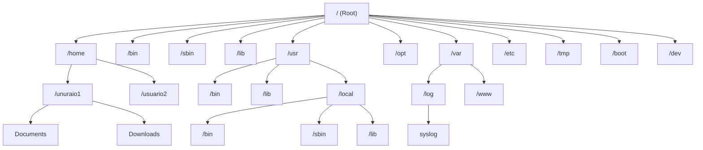

# Module Checklist

# Operating Systems & Linux Basics

# By TechWorld with Nana

# Video Overview

- Introduction to Operating Systems
- Introduction to Virtual Machines (VM Part 1)
- Setup a Linux Virtual Machine (VM Part 2)
- Linux File System
- Introduction to Command Line Interface (CLI Part 1)
- Basic Linux Commands (CLI Part 2)
- Package Manager - Installing Software on Linux
- Vi & Vim Text Editor
- Users & Permissions - Part 1
- Users & Permissions - Part 2
- Basic Linux Commands - Pipes & Redirects (CLI Part 3)
- Shell Scripting - Part 1 (Intro to Shell Scripting)
- Shell Scripting - Part 2 (Basic Concepts & Syntax)
- Shell Scripting - Part 3 (Basic Concepts & Syntax)
- Environment Variables
- Networking
- SSH - Secure Shell

### Introduction to Operating Systems

- [x] Watched video

**Notes:**

* **What is an Operating System?** The computer is made up of hardware, such as Memory, Storage, CPU, and input/output devices. To interact with the hardware, applications like a browser and Visual Studio Code use the Operating System (OS). It is the OS that is able to talk to the hardware and handle the necessary requirements of the applications.
* **What is the CPU?** The CPU is responsible for handling the processes.
  * **Process:** Is any activity that applications perform on the operating system. Every process has its own identifier that helps the CPU manage the queue.
* **What is Memory?** The RAM is responsible for handling the memory allocated in the hardware. It is used for faster access but is not permanent. Sometimes, depending on the process, it is necessary to swap data to the storage.
* **What is Storage?** Storage is the secondary memory that allocates data for long-term use.
* **File System Management:** When the data is stored on the hard drive, it is saved in a structured manner.
  * In Unix systems, it is stored in a tree file system.
  * In Windows systems, it is stored in multiple root file folders.
* **Security:** It is responsible for managing permissions.
* **Networking:** It is designed to assign ports and IP addresses.
* **Kernel:** The kernel acts as an intermediary, translating the OS requests into commands that the hardware can execute.

---

### Introduction to Virtual Machines (VM Part 1)

- [x] Watched video

**Notes:**

* **What is a Virtual Machine?** Virtualization relies on a hypervisor that communicates with the operating system and allocates a portion of the available hardware to create a new PC with virtual hardware, allowing for the installation of a new operating system.
* **Benefits:** You can have a sandbox of that operating system for practice. You can use it if you want to see what a different OS looks like, how it is managed, or if you want to try new software without risking your main operating system files. It is also useful if you want to test how an application performs on a different OS.
* **Types of hypervisors:**
  * **Type 2:** Runs over an existing operating system and is typically used on personal computers.
  * **Type 1:** Runs directly over the hardware and is commonly used by companies in data centers.
* **Advantage of Type 1 Virtualization:** One of the biggest advantages of Type 1 virtualization is the abstraction of the operating system from the hardware. This allows the entire virtual environment to exist as an image, making it portable and not tied to a specific operating system fixed to the physical hardware.

---

### Setup a Linux Virtual Machine (VM Part 2)

- [x] Watched video
- [x] Demo executed
  - [x] Setup VirtualBox
  - [x] Setup Linux Virtual Machine

**Useful Links:**

* **Download VirtualBox:** https://www.virtualbox.org/wiki/Downloads
* **Download Ubuntu:** https://ubuntu.com/download/desktop

**Step 1: VirtualBox and VM Setup**

* **Download VirtualBox:** Download the installer from the official website. The page provides options for different operating systems. You may also download previous versions if needed.
* **Installation:** Run the installer and follow the steps in the Installation Wizard.
* **Hardware Requirements:** At least 4 GB of RAM is recommended to ensure smooth performance when sharing hardware between the host and guest systems.
* **Creating the Virtual Machine (VM):**
  * Create a new VM, assign it a name, and configure the necessary resources.
  * Attach the ISO image of the operating system (in this case, `ubuntu-26.04-desktop-amd64`).
  * Start the VM to begin the OS configuration process. Once the installation is complete, remove the ISO image and reboot the VM.

**VM Management and Features**

* **Power Options:**
  * **Save the machine state:** This acts like "suspension"; when reactivated, the machine resumes exactly where it was left.
  * **Shut down the machine:** Perform a standard system shutdown.
* **Integration Features:** In the VM settings, you can enable **Shared Clipboard** and **Drag and Drop** to share data between the VM and the host system.
* **Extension Pack:** To ensure these integration features work correctly, you must download and install the VirtualBox Extension Pack on the host.
* **Guest Additions:** After starting the VM and logging into Ubuntu, install the Guest Additions:
  * Navigate to the **Devices** tab and select **Insert Guest Additions CD image**.
  * Once mounted, open the disk, right-click `autorun.sh`, and select **Run as a Program**.
  * Authenticate, let the installation finish, close the terminal, unmount the disk, and restart the VM.

---

### Linux File System

- [x] Watched video

In Windows they have a multiple root folder. In Linux is a hierarchical tree structure.



* **`/` (Root):** Is the root of all system, everything start here.
* **`/home`:** This is where all users have their personal space. If there are additional users, they will be listed here; furthermore, some system wide files are occasionally stored within specific user directories.
* **`/bin` (Binaries):** It contains the basic system commands that any user can run (e.g., `cat`, `cp`, `ls`, `cd`).
* **`/sbin` (System Binaries):** Similar to `/bin`, but these commands are for system administration and normally require root or superuser privileges (e.g., `adduser`, `chpasswd`, `iptables`).
* **`/lib` (Libraries folders):** Stores essential shared libraries that executables in `/bin` and `/sbin` need to run, while `lib32`, `lib64`, and `libx32` handle different CPU architectures.
* **`/usr` (User):** Stores system-wide user programs and data. Inside, `/usr/local` holds third-party applications you manually install, making them globally accessible to all users without altering core system files.
* **`/opt` (Optional):** Used for programs that require all components to be contained in a single directory, such as binaries and libraries, this often includes applications like IDEs and web browsers.
* **`/boot` (Booting):** It's for booting the system, that means it should never be touched.
* **`/etc` (Etcetera):** Contains system-wide configuration files for most applications, typically housing `.conf` or `.yaml` files.
* **`/dev`:** Contains files representing hardware devices (e.g., disk drives, terminals, and input devices).
* **`/var` (Variable):** Stores files that constantly change during system operation, such as log files and application caches.
* **`/tmp` (Temporary):** It holds temporary files created by applications that are deleted when the system restarts.
* **`/media` (Media):** It is where the system automatically hooks up plug-and-play devices like USB drives.
* **`/mnt` (Mount):** It is a location used to manually attach external hard drives or temporary file systems.

Understanding the Linux file system hierarchy is critical for efficient debugging and troubleshooting, enabling you to locate configuration files, logs, and system binaries quickly.

---

### Introduction to Command Line (CLI Part 1)

- [ ] Watched video

### Basic Linux Commands (CLI Part 2)

- [ ] Watched video
- [ ] Demo executed

**Useful Links:**

* **Cheat Sheet:** https://cheatography.com/davechild/cheat-sheets/linux-command-line/
* **Cheat Sheet:** https://www.guru99.com/linux-commands-cheat-sheet.html

### Package Manager - Installing Software on Linux

- [ ] Watched video
- [ ] Demo executed

**Useful Links:**

* **Snap Package Manager:** https://snapcraft.io/

### Vi & Vim Text Editor

- [ ] Watched video
- [ ] Demo executed

**Useful Links:**

* **Cheat Sheet:** https://vim.rtorr.com/

### Users & Permissions - Part 1

- [ ] Watched video
- [ ] Demo executed

### Users & Permissions - Part 2

- [ ] Watched video
- [ ] Demo executed

### Basic Linux Commands - Pipes & Redirects (CLI Part 3)

- [ ] Watched video
- [ ] Demo executed

### Shell Scripting Part 1 - Intro to Shell Scripting

- [ ] Watched video
- [ ] Demo executed

### Shell Scripting Part 2 - Basic Concepts & Syntax

- [ ] Watched video
- [ ] Demo executed

### Shell Scripting Part 3 - Basic Concepts & Syntax

- [ ] Watched video
- [ ] Demo executed

### Environment Variables

- [ ] Watched video
- [ ] Demo executed

### Networking

- [ ] Watched video

### SSH - Secure Shell

- [ ] Watched video
- [ ] Demo executed
  - [ ] Create remote server on DigitalOcean
  - [ ] Generate SSH Key Pair on your computer
  - [ ] Copy Bash Script via SCP
  - [ ] Execute Bash Script on the remote server
  - [ ] Don’t forget to delete Droplet when you are done!

```
